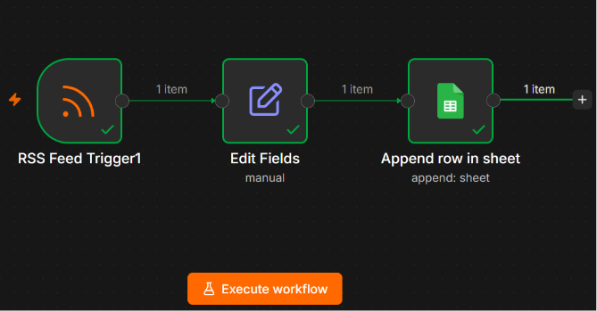

# n8n-rss-to-sheets-automation
Automated content curation pipeline built with n8n - continuously monitors a Medium RSS feed and archives new articles into Google Sheets, eliminating manual tracking.
<div align="center">
<div align="center">

# Reading List Automation

### *Turning a RSS feed into a self-updating archive — zero manual effort.*


</div>

## Overview

Manually checking a favorite publication for new posts is a small task that quietly wastes time. This workflow removes it entirely - it listens for new Medium articles the moment they're published, extracts what matters, and archives it into a growing spreadsheet automatically.

> No manual checking. No copy-pasting. Just a living reading list.

## How It Works

```
RSS Feed Trigger  →  Edit Fields  →  Google Sheets (Append Row)
   (listen)          (transform)         (persist)
```

| Stage | Node | Role |
|---|---|---|
| 🎯 | **RSS Feed Trigger** | Polls the Medium feed on a fixed interval |
| 🧹 | **Edit Fields** | Cleans the payload into `title`, `link`, `date` |
| 💾 | **Google Sheets** | Appends a new row - the archive builds itself |

## In Action

**The complete pipeline, verified end-to-end**



**Articles landing automatically in the sheet**


## Stack

- **n8n** - visual workflow orchestration
- **Google Sheets API** - lightweight, human-readable storage
- **RSS/Atom** - the content source protocol

## 🚀 Getting Started

1. Import `Reading List Otomatis Medium.json` into your n8n instance (`...` menu → Import from File)
2. Set the RSS Feed Trigger's Feed URL
3. Connect your Google account and select a target spreadsheet
4. Activate the workflow — new articles start flowing in automatically

## Why This Matters

This is a small project, but it demonstrates a pattern used everywhere in real automation systems: **trigger → transform → persist**. The same three-step logic scales to notifications, data pipelines, CRM syncs, and beyond - RSS is just the friendliest place to start.

---

<div align="center">

*Built while exploring workflow automation with n8n*

</div>
